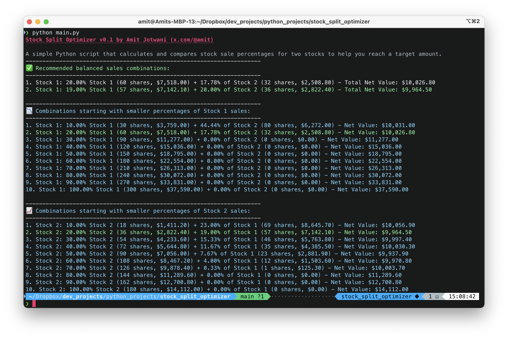

# StockSplit Optimizer
A simple Python script that calculates and compares stock sale percentages for two stocks to help you reach a target amount.

---

## What is this?
I've been pondering the best percentage of stocks to sell to hit a specific target, so I decided to write a simple Python script to help me explore different options with two stocks. Nothing fancy—just a straightforward CLI script that runs with a set of environment variables.

When I run the script, it calculates various combinations of sales percentages for both stocks, and then highlights the "balanced" recommendation. This recommendation is based on the minimal difference between the percentages of Stock 1 and Stock 2 sold. Of course, "balanced" can be subjective, but this logic seemed reasonable for my needs.

Just set your variables and run the script to get a clear view of your options!

Here's an example using $10,000 as the target amount.

## How to Use This Script

1. **Set Up Environment Variables:**
   - Create a `.env` file in the root directory of the project.
   - Define the following environment variables:
     - `STOCK1_NAME`: The name of the first stock.
     - `STOCK1_PRICE`: The current price per share of the first stock.
     - `STOCK1_SHARES`: The total number of shares you hold of the first stock.
     - `STOCK2_NAME`: The name of the second stock.
     - `STOCK2_PRICE`: The current price per share of the second stock.
     - `STOCK2_SHARES`: The total number of shares you hold of the second stock.
     - `TAX_PERCENTAGE`: The tax rate applicable to your stock sales.
     - `TARGET_AMOUNT`: The target amount you wish to reach by selling stocks.

2. **Run the Script:**
   - Ensure you have Python installed on your system.
   - Install the required dependencies using `pip install -r requirements.txt` if necessary.
   - Run the script using `python main.py`.

3. **View Results:**
   - The script will output different combinations of stock sales percentages to reach your target amount.
   - It will highlight the most balanced combination, where the percentage difference between the two stocks sold is minimal.

This script is a simple and effective way to explore various options for selling stocks to meet a financial target. Just plug in your data, and let the script do the calculations!